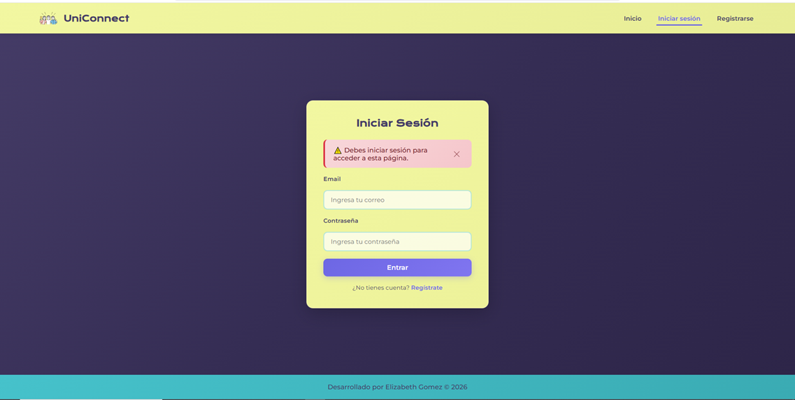
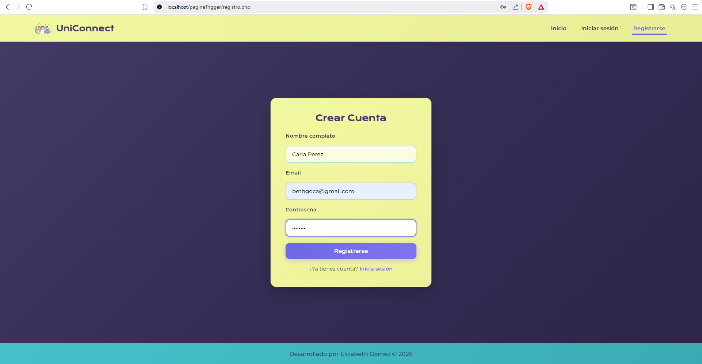
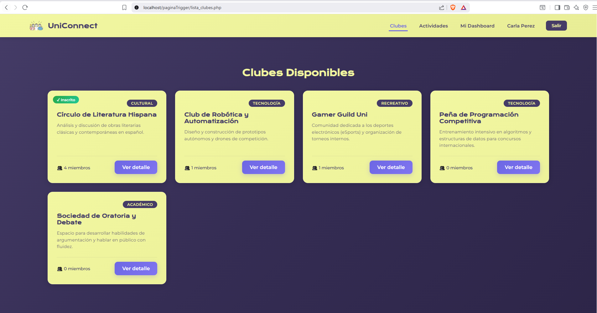
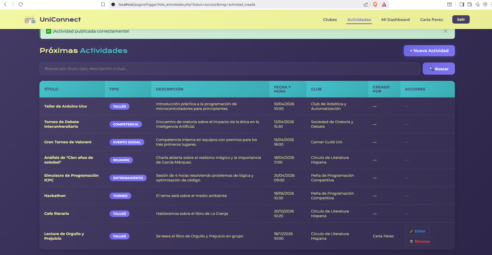

# 🎓 UniConnect

**Plataforma web universitaria** para la gestión de clubes estudiantiles, membresías y actividades. Permite a los estudiantes descubrir clubes, unirse a comunidades y mantenerse al día con eventos y talleres.

---

## ✨ Características

- **Registro e inicio de sesión** con contraseñas cifradas (bcrypt)
- **Explorar clubes** por categoría (Tecnología, Académico, Cultural, Recreativo)
- **Unirse / abandonar clubes** con un solo clic
- **Crear, editar y eliminar actividades** (talleres, torneos, reuniones, etc.)
- **Buscador de actividades** con filtros por título, tipo, descripción y club
- **Dashboard personalizado** con resumen de clubes inscritos y próximos eventos
- **Perfil de usuario** con historial de membresías
- **Auditoría automática** mediante triggers (log de usuarios registrados y actividades eliminadas)
- **Procedimientos almacenados** para operaciones CRUD seguras

---

## 📸 Capturas de Pantalla

### Página de inicio


### Inicio de sesión


### Registro de usuario


### Explorar clubes


### Gestión de actividades


---

## 🛠️ Tecnologías

| Capa | Tecnología |
|------|------------|
| **Frontend** | HTML5, CSS3, SVG |
| **Backend** | PHP 8.x |
| **Base de datos** | MariaDB 10.4 / MySQL |
| **Servidor local** | XAMPP (Apache) |
| **Gestión de BD** | phpMyAdmin |

---

## 🗄️ Esquema de Base de Datos

```
uniconnect_db
├── usuarios          — Registro de estudiantes
├── clubes            — Catálogo de clubes
├── miembros_club     — Relación usuarios ↔ clubes
├── actividades       — Eventos, talleres, reuniones
└── log_auditoria     — Registro automático de acciones (triggers)
```

### Diagrama relacional

```
usuarios ──┬──< miembros_club >──── clubes
            │                         │
            └──< actividades >────────┘
```

---

## 🚀 Instalación

### Prerrequisitos

- [XAMPP](https://www.apachefriends.org/) (incluye Apache, PHP y MariaDB)
- Navegador web moderno

### Pasos

1. **Clona el repositorio** dentro de la carpeta `htdocs` de XAMPP:

   ```bash
   cd C:\xampp\htdocs
   git clone https://github.com/beth-gc/Uniconnect.git
   ```

2. **Inicia los servicios** de Apache y MySQL desde el panel de control de XAMPP.

3. **Crea la base de datos:**
   - Abre [phpMyAdmin](http://localhost/phpmyadmin)
   - Crea una nueva base de datos llamada `uniconnect_db`
   - Importa el archivo `uniconnect_db.sql`
   - Luego importa `procedimientos_triggers.sql`

4. **Configura la conexión** en `baseDatos.php` si tu puerto de MySQL es diferente:

   ```php
   $servidor = "localhost:3307";  // Cambia el puerto si es necesario
   ```

5. **Accede a la aplicación:**

   ```
   http://localhost/Uniconnect/
   ```

---

## 📁 Estructura del Proyecto

```
Uniconnect/
├── assets/                        # Recursos estáticos
│   ├── fcc.png                    # Imagen de presentación
│   └── logo.svg                   # Logo de UniConnect
│
├── includes/                      # Componentes reutilizables (PHP)
│   ├── header_publico.php         # Navegación para visitantes
│   ├── header_privado.php         # Navegación para usuarios autenticados
│   ├── footer.php                 # Pie de página
│   ├── alertas.php                # Sistema de mensajes flash
│   ├── sesion.php                 # Inicialización de sesión
│   └── proteger.php               # Middleware de autenticación
│
├── styles/                        # Hojas de estilo
│   ├── style.css                  # Estilos globales y landing
│   ├── style_formularios.css      # Login y registro
│   ├── style_clubes.css           # Lista de clubes
│   ├── style_detalle_club.css     # Detalle de club
│   ├── style_lista.css            # Lista de actividades
│   ├── style_dashboard_estudiante.css  # Dashboard
│   └── style_perfil.css           # Perfil de usuario
│
├── index.php                      # Página de inicio (landing)
├── login.php                      # Formulario de inicio de sesión
├── registro.php                   # Formulario de registro
├── dashboard_estudiante.php       # Panel principal del estudiante
├── lista_clubes.php               # Explorar clubes
├── detalle_club.php               # Información detallada de un club
├── miembros_club.php              # Miembros de un club
├── lista_actividades.php          # Explorar actividades
├── crear_actividad.php            # Formulario para crear actividad
├── editar_actividad.php           # Formulario para editar actividad
├── confirmar_eliminar.php         # Confirmación de eliminación
├── perfil.php                     # Perfil del usuario
│
├── procesar_login.php             # Lógica de autenticación
├── procesar_registro.php          # Lógica de registro
├── procesar_actividad.php         # Lógica de creación de actividad
├── procesar_editar_actividad.php  # Lógica de edición de actividad
├── eliminar_actividad.php         # Lógica de eliminación de actividad
├── procesar_membresia.php         # Lógica de unirse/salir de club
├── cerrar_sesion.php              # Cierre de sesión
├── baseDatos.php                  # Configuración de conexión a BD
│
├── uniconnect_db.sql              # Dump completo de la base de datos
├── procedimientos_triggers.sql    # Stored procedures y triggers
└── .gitignore
```

---

## 👩‍💻 Autora

Desarrollado por **Elizabeth Gómez** como proyecto universitario.

---

## 📄 Licencia

Este proyecto es de uso académico. Todos los derechos reservados.
